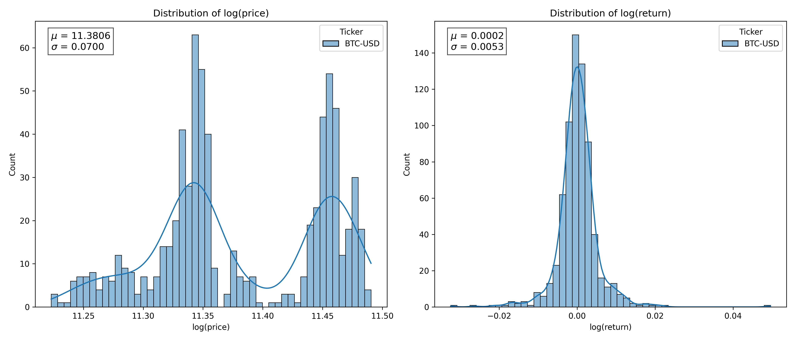
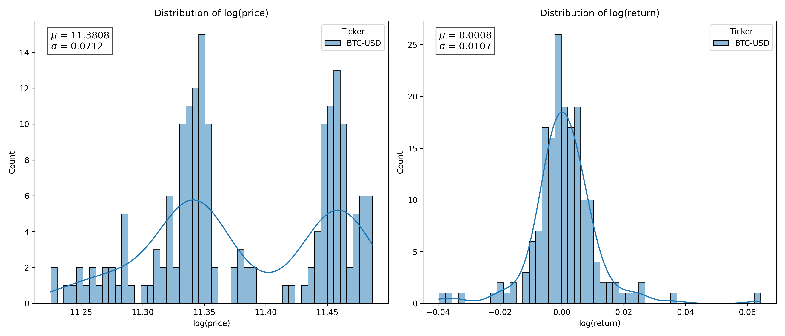
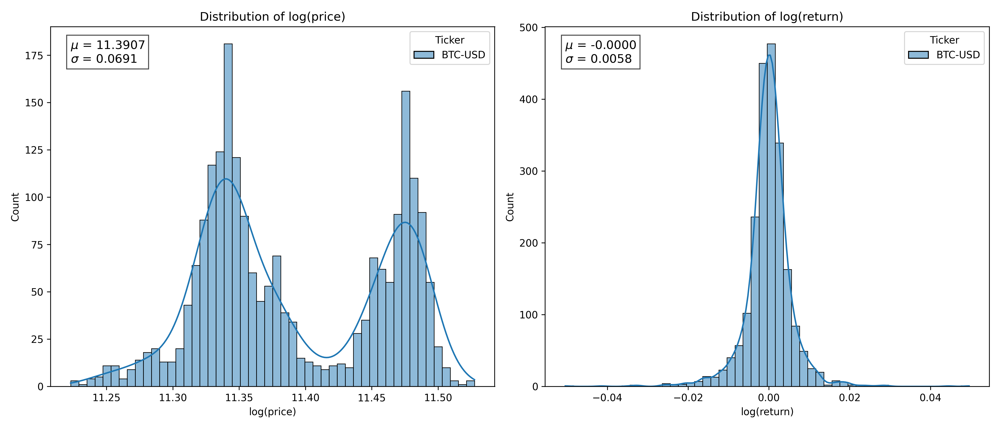

# **Stochastic Processes, Brownian Motion, and Time Series**

## **1. Formal Definitions**

- A **stochastic process** is a collection of random variables ${X_t}\_{t \in \mathcal{T}}$ indexed by time or space, representing the evolution of a system with inherent randomness.

- A process ${X_t}\_{t \in \mathbb{Z}}$ is **weakly stationary** (or covariance stationary) if:

  1. $\mathbb{E}[X_t] = \mu$ (mean is constant over time),
  2. $\text{Var}(X_t) < \infty$ (finite, constant variance),
  3. $\text{Cov}(X_t, X\_{t+h}) = \gamma(h)$ depends only on lag $h$, not on $t$.

---

## **2. Brownian Motion**

A **Brownian motion** (or **Wiener process**) ${B_t}\_{t \geq 0}$ satisfies:

1. **Initial Condition**:

   $$
   B_0 = 0 \quad \text{(almost surely)}
   $$

2. **Independent Increments**:
   For $0 \leq t_0 < t_1 < \dots < t_n$, the increments:

   $$
   B_{t_1} - B_{t_0},\ B_{t_2} - B_{t_1},\ \dots,\ B_{t_n} - B_{t_{n-1}}
   $$

   are independent.

3. **Stationary Increments**:
   For $s < t$,

   $$
   B_t - B_s \sim \mathcal{N}(0, t - s)
   $$

4. **Continuity**:
   Paths $t \mapsto B_t(\omega)$ are continuous almost surely.

> **Summary Notation**:
>
> $$
> B_t \sim \mathcal{N}(0, t), \quad \mathbb{E}[B_t] = 0, \quad \text{Var}(B_t) = t
> $$
>
> The sample paths are continuous but almost surely nowhere differentiable.

---

## **3. Example: Black-Scholes Price Dynamics**

Consider the Black-Scholes stochastic differential equation:

$$
\frac{d S_t} {S_t} = \mu\, dt + \sigma\, dW_t
$$

Here, the return $dS_t$ follows:

$$
dS_t \sim \mathcal{N}(\mu\, dt, \sigma^2\, dt)
$$

This implies that **log-returns** over fixed intervals (e.g. 1 hour) are normally distributed:

| Time ($T$) | Price ($S_T$) | Change ($dS_T$) |
| ---------- | ------------- | --------------- |
| $t_0$      | 1.20          | –               |
| $2t_0$     | 1.32          | 0.12            |
| $3t_0$     | 1.94          | 0.62            |
| $4t_0$     | 1.50          | –0.44           |
| $5t_0$     | 1.76          | 0.26            |

### Visualization:

We observe log-price and log-return distributions for:

- Upper: $T = 30$ days, $\Delta t = 1$ hour
- Middle: $T = 30$ days, $\Delta t = 4$ hours
- Lower: $T = 90$ days, $\Delta t = 1$ hour

**Observations**:

- Larger total period ($T$) yields better approximation of the true (population) distribution.
- Doubling $\Delta t$ (timeframe) roughly doubles the return volatility.

---

## **4. Stationarity of Log-Returns**

- Log-return $d \log S_t$ follows $\mathcal{N}(\mu t_0, \sigma^2 t_0)$ for fixed timeframe $\Delta t = t_0$.
- Mean and variance **do not** change with absolute time $T$, making the process **covariance stationary**.
- Returns at each $\Delta t$ are **i.i.d.**, so volatility scales with $\sqrt{\Delta t}$, not $T$.

  **Illustration**:

- Suppose a price process $S_t$ has log-values:

  $$
  \log S_t = \{f(t_0), f(2t_0), f(3t_0), f(4t_0), \dots, f(T)\}, \quad
  $$

  $$
  \text{where } f(t)
  \sim \mathcal{N}(\mu_t \log S_0 + (\mu -\sigma^2/2) t , \sigma_t^2=\sigma^2 t)
  $$

  $$E[\log S_t] = \log S_0 + (\mu -\sigma^2/2) t = \Mu_t$$
  $$\text{Var}[\log S_t] = \sigma^2 t = \Sigma_t$$

  This means that the **mean and variance depend on both** the timeframe $\Delta t = t_0$ and the **total time** $T$.

- In contrast, the log-returns (modeled as $dW_t$) are:

  $$
  \log\left(\frac{S_t}{S_{t - t_0}}\right) = \{f(t_0), f(t_0), f(t_0), f(t_0), \dots\}
  $$

  where each term is i.i.d. $\sim \mathcal{N}(\mu t_0, \sigma^2 t_0)$—independent of $T$.

This shows:

- **Log-prices** evolve over time and are **non-stationary** (variance increases with $T$),
- **Log-returns** are **stationary**—their distribution depends on $\Delta t$, but **not** on $T$.

## **4. Stationarity of Log-Returns**

- Log-return $d \log S_t$ follows $\mathcal{N}(\mu t_0, \sigma^2 t_0)$ for time frame $\Delta t = t_0$.
- The **mean** and **variance** are time-independent, hence the process is **covariance stationary**.
- Even though returns scale with $\Delta t$, they do **not** depend on absolute time $T$.
- The scaling of volatility follows: $\sigma\_{\Delta t} \propto \sqrt{\Delta t}$.

> **Clarification**:
>
> - Stationarity implies that properties do not evolve with time.
> - Timeframe $\Delta t$ determines variance, not the dataset duration $T$.

---

### Is log-return an $I(0)$ process?

- Yes, by definition. A stationary process is an $I(0)$ process.

### What ARIMA model fits log-return?

- Log-return under Black-Scholes is **white noise**, modeled by **ARIMA(0,0,0)**.

---

## **5. Discrete vs Continuous Processes**

| Discrete Model                             | Continuous Counterpart               |
| ------------------------------------------ | ------------------------------------ |
| Random Walk: $X_t = X\_{t-1} + \epsilon_t$ | Brownian motion: $W_t$               |
| White Noise: $Y_t = dX_t = \epsilon_t$     | $Y_t = dW_t$ (stationary increments) |

### Random Walk vs First Difference:

- Random walk accumulates white noise:

  $$
  X_t = \sum_{i=1}^t \epsilon_i, \quad \text{Var}(X_t) = t\sigma^2
  $$

  → **Not stationary**

- First difference:

  $$
  Y_t = X_t - X_{t-1} = \epsilon_t
  $$

  → **Stationary**

---

## **6. Brownian Motion vs Log-Price**

- Brownian motion: $\text{Var}(W_t) = t$ → **not stationary**
- Log-price also follows a non-stationary path:

  $$
  \mathbb{E}[\log S_t] = \log S_0 + (\mu - \sigma^2/2)t \\
  \text{Var}[\log S_t] = \sigma^2 t
  $$

So, log-prices evolve with time. But **log-returns**, defined over fixed $\Delta t$, are i.i.d. and **stationary**.

---

## **7. Cointegration and Statistical Arbitrage**

- Let $X_t, Y_t$ be two $I(1)$ processes.
- If there exists a linear combination:

  $$
  S_t = Y_t - \alpha - \beta X_t
  $$

  such that $S_t$ is **stationary**, then $X_t$ and $Y_t$ are **cointegrated**.

### Is the spread $S_t$ affected by the timeframe $\Delta t$?

- **No.**
- Here, the $I(0)$ process is **constructed** via linear combination, not by differencing.
- Therefore, its distribution is independent of $\Delta t$ (unlike log-return, which depends on $\Delta t$).
