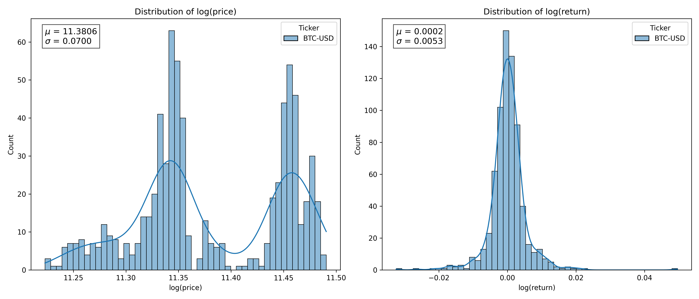

# Stochastic process, Brownian motion, timeseries and all

## Some formal defintion

- A **stochastic process** is a collection of random variables indexed by time or space (or more generally, by some index set), representing the evolution of some random quantity over that index.

- A stochastic process $\{X_t\}_{t \in \mathbb{Z}}$ is **weakly/covariant stationary** if:

  1. $\mathbb{E}[X_t] = \mu$, a constant (mean is time-invariant),
  2. $\text{Var}(X_t) = \mathbb{E}[(X_t - \mu)^2] < \infty$ (finite, constant variance),
  3. $\text{Cov}(X_t, X_{t+h}) = \gamma(h)$ depends only on the lag $h$, not on time $t$.

- **Definition of Brownian Motion**

  A **Brownian motion** (also called **Wiener process**) is a continuous-time stochastic process $\{B_t\}_{t \geq 0}$ that satisfies the following properties:

  1. **Initial condition**:

  $$
  B_0 = 0 \quad \text{(almost surely)}
  $$

  2. **Independent increments**:
     For any $0 \leq t_0 < t_1 < t_2 < \dots < t_n$, the increments

  $$
  B_{t_1} - B_{t_0},\ B_{t_2} - B_{t_1},\ \dots,\ B_{t_n} - B_{t_{n-1}}
  $$

  are independent random variables.

  3. **Stationary increments**:
     For $s < t$, the increment $B_t - B_s$ has a **normal distribution**:

  $$
  B_t - B_s \sim \mathcal{N}(0, t - s)
  $$

  4. **Continuity**:
     The sample paths $t \mapsto B_t(\omega)$ are **almost surely continuous** functions of $t$.

  ***

  ### **Notation:**

  A standard Brownian motion is often written as:

  $$
  B_t \sim \mathcal{N}(0, t), \quad \text{with } B_0 = 0
  $$

  - $\mathbb{E}[B_t] = 0$
  - $\text{Var}(B_t) = t$
  - $B_t$ has nowhere differentiable paths (almost surely)

## Example

Consider a Black-Scholes price below,  
$$\frac{d S_t} {S_t} = \mu dt + \sigma dW_t$$

The distribution of $dS_t$ is a normal distribution $\mathcal{N}(\mu dt, \sigma^2 dt)$ as the first component gives deterministic drift and the second component is a random noise with zero mean, of variance $\sigma^2 dt$. Now let's try to digrace this. What does it mean in real life.

- Suppose you have a price (time) series
  $S_t = \{1.20, 1.32, 1.94, 1.50, 1.76, \}$. The equation is saying if we plot the $d\log{S_T}$ **then that will be a normal distrbution**.

| $T$    | $S_T$ | $dS_T$ |
| ------ | ----- | ------ |
| $t_0$  | 1.20  | -      |
| $2t_0$ | 1.32  | 0.12   |
| $3t_0$ | 1.94  | 0.62   |
| $4t_0$ | 1.50  | -0.44  |
| $5t_0$ | 1.76  | 0.26   |

Below I have plotted the log(price) and log(return) for

- Upper ($T=30\,\text{day}$, $\Delta t = 1\,\text{hr}$)
- Middle ($T=30\,\text{day}$, $\Delta t = 4\,\text{hr}$)
- Lower ($T=90\,\text{day}$, $\Delta t = 1\,\text{hr}$)

Notice,

- The third plot has higher $T$, which makes the sampling distribution more like population distribution.
- The sigma for $\Delta t = 4\,\text{hr}$ is 2x that of $\Delta t = 1\,\text{hr}$

### Now what is the mean and sigma of this distribution?

- Here $dt \rightarrow t_0$ and hence normal distribution: $\mathcal{N}(\mu t_0, \sigma^2 t_0)$

### Is the $d\log{S_T}$ or log-return is (covariant) stationary process?

- The mean and sigma of the distribution is time independent. Since each time-step is independent (property of brownian motion) the auto-covariance is also zero. Hence it is a covariant stationary process.
- There may arise confustion that they are depending on $t_0$ then how it is time independent?
  - We are looking for a log(return) of a stock price for a fixed time frame say $t_0 = 1 \,\text{hr}$, now with this $t_0 = 1 \,\text{hr}$ timeframe data we can make distribution with 1 year or 20 year of data, the normal distribution will resembles population distribution ($T = 1 \,\text{yr} \to T = 20\, \text{yr} \equiv \text{sampling distribution} \to \text{Population distribution}$ )
- Then what about the claim volatality scales with $\sim \sqrt{t}$?
  - To avoid any confustion we can make it $\sim \sqrt{\Delta t}$, and with ${\Delta t}$ we mean the timeframe, not absolute time (total duration of data T = 20 year say)
  - When we check log-return of $\Delta t =1\, \text{yr}$ timeframe, and plot distribution of multiple (successive / simulated) years $(T)$ then the distribution will also will not change (of course if other condition does not change) over the year and will make the sampling distribution towards the Population distribution.
  - But the distribution $\sigma_{\text{1\,\text{yr}}} = \sqrt{252} \sigma_{\text{1\,\text{day}}}$, so the log(return) is stationary process and mean/width/auto-covariance does not change over time but they depend on the timeframe overwhich these are calculated, 1hr / 1 day/ 1 yr.
- Is the log(return) a $I(0)$ process?
  - By defintion stationary process itself is $I(0)$ process.
- How we can model log(return) with discrete timeseries model in ARIMA?
  - The log (return) of a Black-Scholes price is a white noise ARIMA(0,0,0).

## Discrete vs continuous

| Discrete                                                          | Continuous                                           |
| ----------------------------------------------------------------- | ---------------------------------------------------- |
| Random walk, ARIMA(1, 1, 0), $X_t= X_{t-1} + \epsilon_t$          | Brownian motion $W_t$                                |
| White noise (Stationary) ARIMA(0, 0, 0), $Y_t = dX_t= \epsilon_t$ | Stationary increment of Brownian motion $Y_t = dW_t$ |

### Random Walk and its first difference

- Random walk $X_t = \sum_{i=1}^t \epsilon_i$ is total sum of all the steps of white noise process. So at time $t$ it bags all the stationary increment which makes it dependent on t, $\text{Var}(X_t) = t \text{Var}(\epsilon_0)=t \sigma^2$. Since this depend on time, it's not-stationary process.
- However $Y_t$ does not bag all the increment, but only increment of that particular time, $\text{Var}({Y_t}) = \sigma^2$

## Brownian motion and its first difference

- According to defition normalized brownian motion's variance $\text{Var}(W_t) = t$. The behaviour is same as discrete one. Since this depend on time, it's not-stationary process.
- As an example we can consider price series, and if we are to make a histogram of the log(price) series it will not give you a normal distribution.
  $$E[\log S_t] = \log S_0 + (\mu -\sigma^2/2) t = M_t$$
  $$\text{Var}[\log S_t] = \sigma^2 t = \Sigma_t$$

* Suppose $\mathcal{N}(M_{t_0}, \Sigma_{t_0}) = f(t_0)$ is a random variable then So for a price series, the mean and variance depends on $\Delta t = t_0$ and $T$

$$\log S_t = \{ f(t_0), f(2t_0), f(3t_0), f(4t_0), f(5t_0), f(6t_0)... f(T)\}$$

- But for $dW_t$, all are i.i.d. and hence it will give fixed variance, does not depend on $T$

$$\log (S_t/S_0) = \{ f(t_0), f(t_0), f(t_0), f(t_0), f(t_0), f(t_0)... f(t_0)\}$$

## Cointegration and statistical arbitrage spread

Suppose two $I(1)$ series $X_t, Y_t$ are cointegrated, hence there exist a linear combination of these two series $Y_t = \alpha + \beta X_t + S_{t}$, where $S_{t}$ is an $I(0)$ process.

### If we consider the distribution of $S_t$ series for a timeframe $\Delta t = 1\,\text{hr}$ vs $\Delta t = 4\,\text{hr}$, the width of latter will be 2x that of former?

- **NO**
- Because in earlier case we made $I(1)$ series out of $I(0)$ series by taking the first difference. That caused the difference timeframe $\Delta t$, as important parameter, deciding the width of the $I(0)$ series.
- But here $\Delta t$ has no role, by construction the spread is an $I(0)$ process.

## Random walk vs AR(1)

$$X_t = \phi X_{t-1} + \epsilon_t$$
$$X_t =  \sum_{k = 0}^{t-1} \phi^{k}\epsilon_{t-k}$$

- Become stationary process (ARIMA(1,0,0)) charecteristic root $1/\phi > 1 \Rightarrow \phi < 1$.We can use earlier expression to calculate mean and variance but for stationary process, we know mean and variance is independent of time, which imply $\text{Var}(X_t) = \text{Var}(X_{t-1})$. So $\text{Var}(X_t) = \phi^2 \text{Var}(X_{t-1}) + \text{Var}(\epsilon_t) \Rightarrow \text{Var}(X_t) = \frac{\sigma^2}{1-\phi^2}$

- For $\phi = 1$ it is a random walk (ARIMA(1, 1, 0)). $X_t = \sum_{i = 1}^{t} \epsilon_t$
- For $\phi>1$ it is a non-stationary process. $X_t = \phi^t + \epsilon_t$, both mean and sigma diverge with time.

## White noise vs other stationary process

- White noise are those stationary process whose auto-correlation is zero, that is $\text{Cov}(\epsilon_t, \epsilon_s) = \sigma^2\delta_{t,s}$.
- Where as for simple AR(1) process $X_t = \phi X_{t-1} + \epsilon_t$, $\text{Cov}(X_t, X_{t-s})=\frac{\sigma^{2} \phi^s}{1-\phi^2}$
